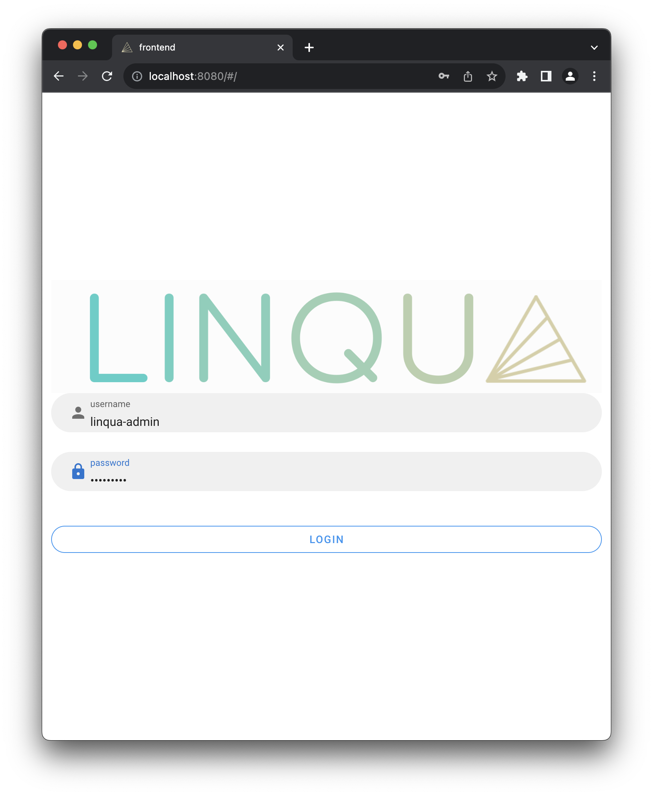
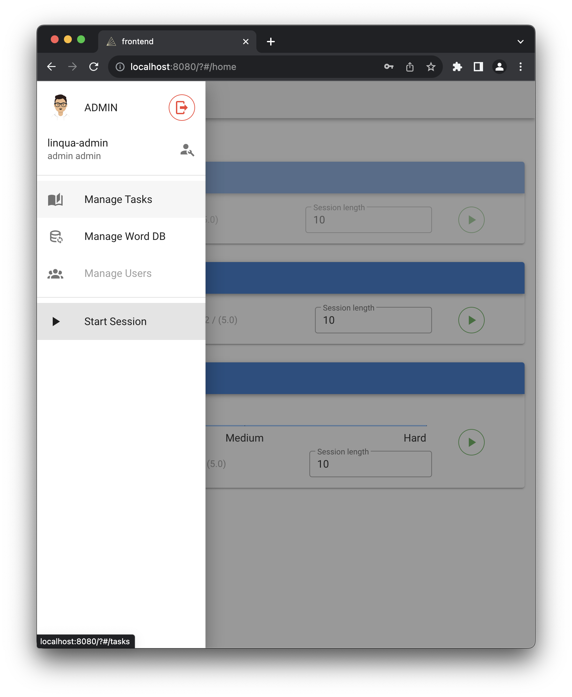
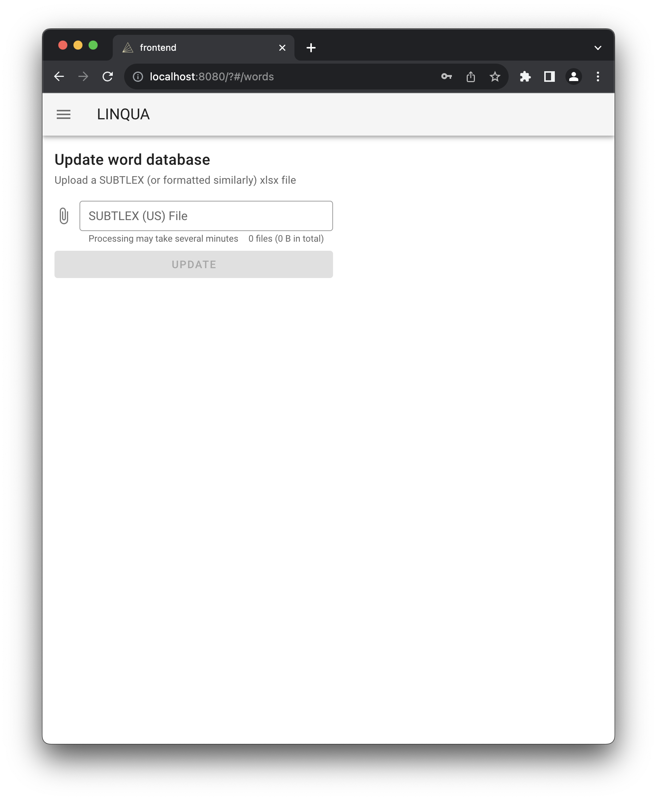
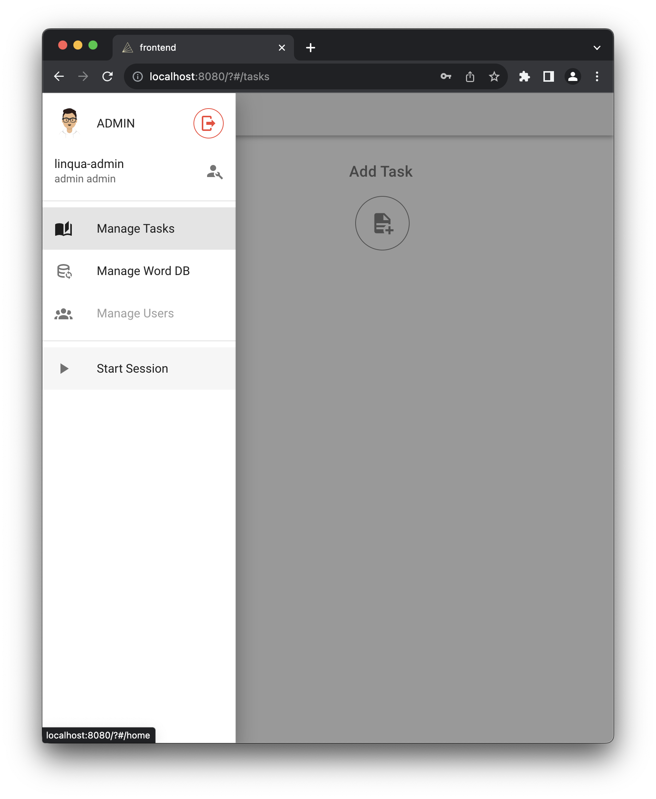
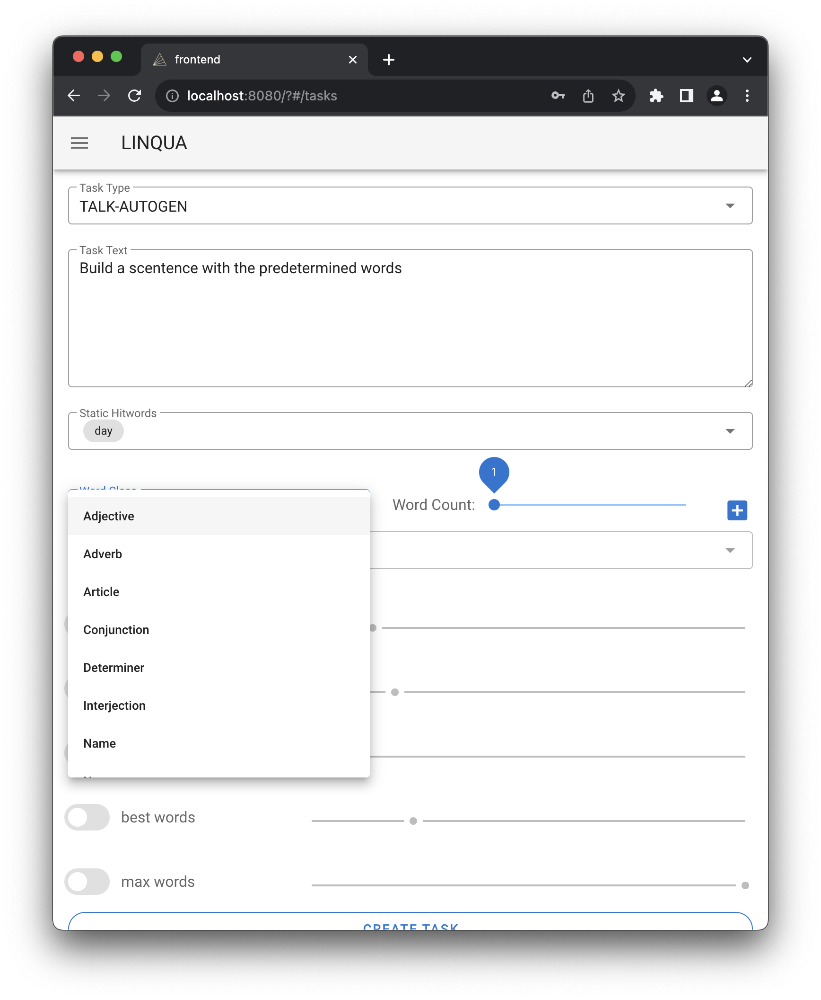
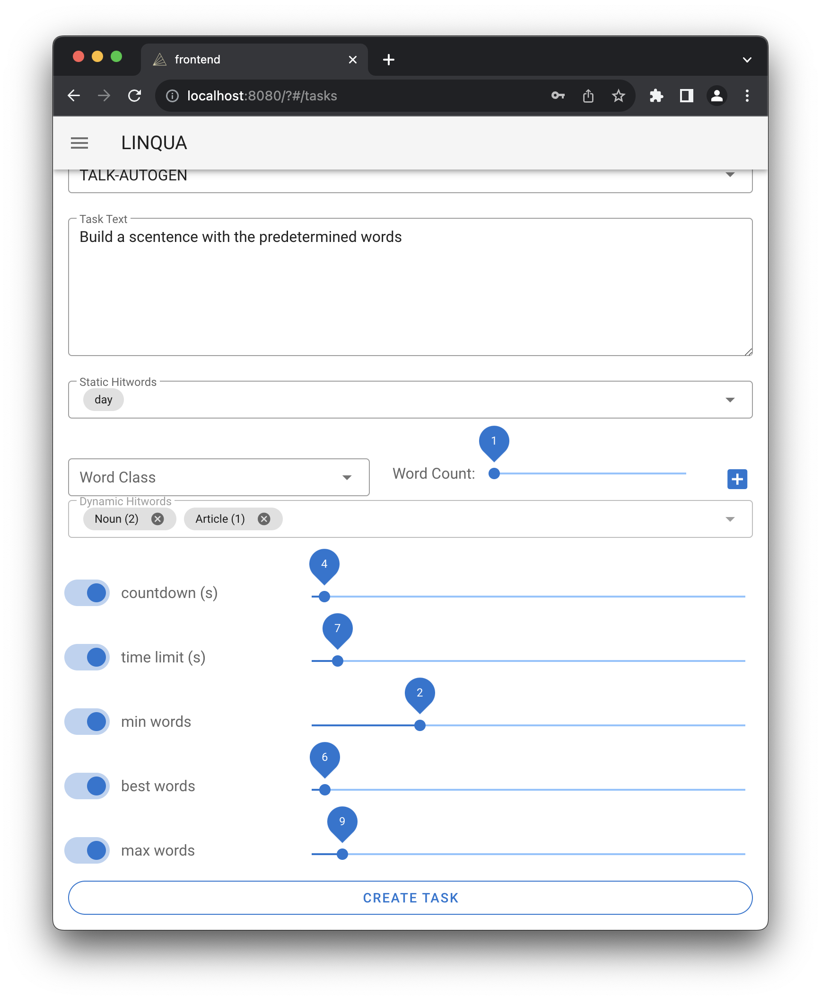
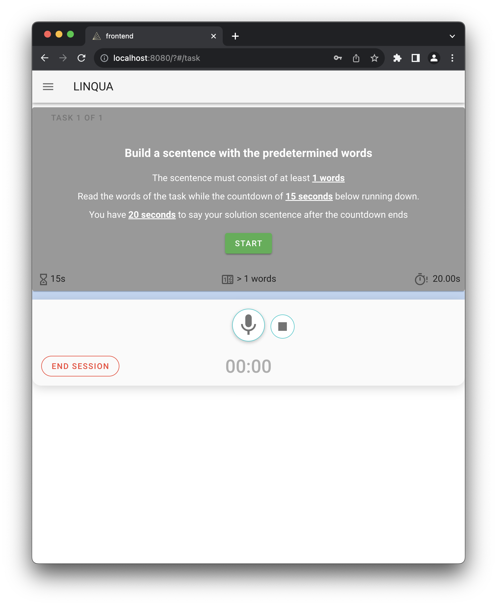
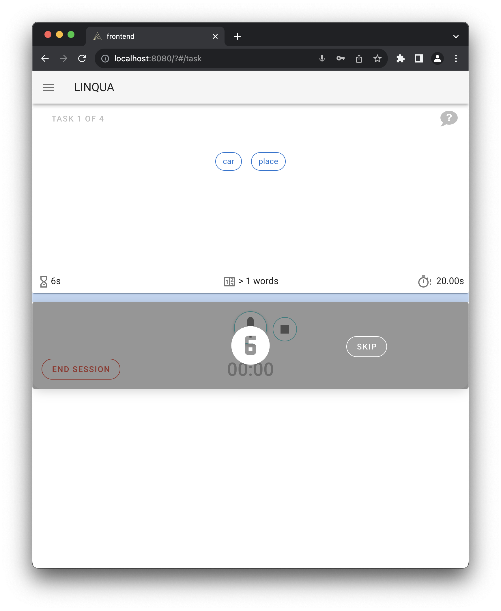
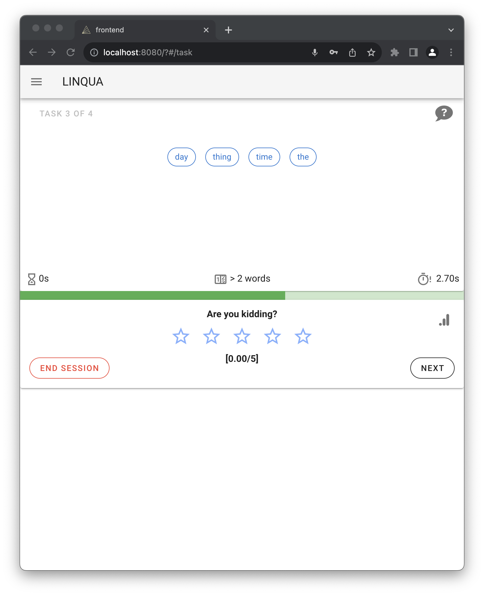
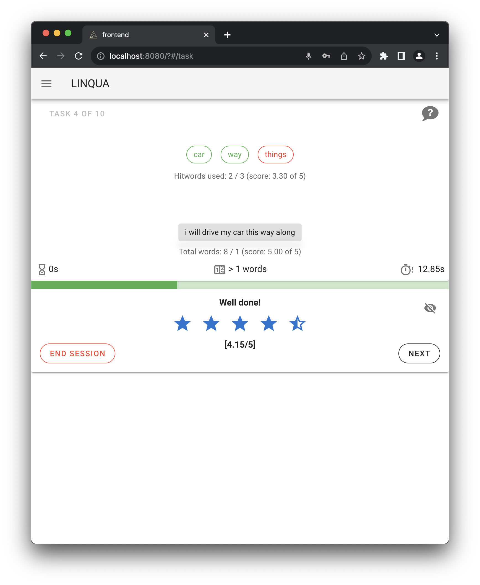

# LINQUA
## Installationsanleitung für OSX und Linux

1. Installation java runtime
2. Installation ffmpeg
```bash
$ brew install ffmpeg         //MacOS
$ sudo apt install ffmpeg     //Linux
```
3. Mit [run.sh](backend/run.sh) Skript starten um das Backend zu konfigurieren
```bash
$ bash run.sh setup
```

4. Mit [run.sh](backend/run.sh) den Server im Dev Modus starten
```bash
// Im backend Ordner
$ bash run.sh dev
```

5. Frontend Starten - Im Dev Modus

Auf Windows und OSX muss die Umgebungsvariable NODE_OPTIONS gesetzt werden

```bash
export NODE_OPTIONS=--openssl-legacy-provider
// Im frontend Ordner
$ npm install
$ npm run serve
```
6. Es kann bis zu 5 Minuten dauern, bis die Anwendung vollständig gestartet ist


## RUN.SH Hinweise
Mit dem Skript [run.sh](backend/run.sh) wird durch das Argument `setup` die Umgebung vorbereitet, mit `dev` wird der Development und `prod` der Produktionsmodus gestartet
```bash
$ bash run.sh setup
$ bash run.sh dev
$ bash run.sh prod
```

## SUBTLEX_US
Downloadlink für die SUBTLEX_US Tabelle [Download](https://osf.io/download/7wx25/)

### Warum SUBTLEX_US ?
Mit der SUBTLEX_US Tabelle haben wir eine umfrangreiche Wortdatenbank, welche nicht nur angibt wie oft ein Wort vorkommt, sondern auch schon mit einer klassifizierung der Wortart (POS-Tagging). 
Zusätzlich ist für jedes Wort, respektive dessen Wortart, eine Wahrscheinlichkeit angegeben, wie oft diese auch für das jeweilige Wort zutrifft.


## Funktionsumfang der App
Die App soll das freie und flüssige Sprechen einer Fremdsprache (Englisch) verbessern.
Dazu muss der Benutzer vorgegebene Wörter verwenden und spontan einen Satz bilden.
Über einen Speech-to-Text Ansatz wird dieser dann in die App übertragen, um dann analysiert und bewertet zu werden.

## Starten der Anwendung
Die App ist nun erreichbar unter http://localhost:8080

### Loginscreen
Es gibt einen Standard Admin Account, welcher automatisch angelegt wird. Die Zugangsdaten sind **linqua-admin** und **admin123**


Nach dem Loginscreen gelangt man in das Hauptmenü.
Zuerst muss eine Wortdatenbank importiert werden und eine neue Aufgabe angelegt werden.


Dazu links oben auf das Hamburgermenü drücken und **Manage Word DB** auswählen.



An dieser Stelle muss die [SUBTLEX_US](https://osf.io/download/7wx25/) Tabelle hochgeladen werden.



Nun muss die erste Aufgabe angelegt werden. 
Dazu über das Hamburgermenü auf **Manage Tasks** klicken.



Task Type **TALK-AUTOGEN** auswählen.

- **Task Text** ist eine Beschreibung der Aufgabe, welche angezeigt werden soll.

- **Static Hitwords** sind Wörter, welche statisch vorgegeben werden, immer enthalten sind und verwendet werden müssen.

- **Word Class** ist die Wortklasse, welche für die dynamisch generierten Wörter gelten solll.

- **Word Count** gibt die Anzahl der für die Wortart ausgewählten, dynamischen, Wörter an.

- **Countdown** gibt an, wie viel Zeit zum Vorbereiten auf die Spracheingabe gewährt wird.

- **Time limit** gibt an, wie viel Zeit zum Sprechen des Satzes zur Verfügung steht.

- **min words** gibt die Anzahl an Wörtern an, ab welcher ein erster Punkteboni gewährt wird.

- **best words** gibt die Anzahl an Wörtern an, ab welcher ein höherer Punkteboni gewährt wird.

- **max words** gibt die Anzahl an Wörtern an, ab welcher der höchste Punkteboni gewährt wird.

**CREATE TASK** legt die Aufgabe in der Datenbank an.




Über das Bürgermenu und **Start Session** gelangt man ins Hauptmenü und kann nun für den Aufgabentyp TALK-AUTOGEN die Schwierigkeit und die Anzahl der Wiederholungen auswählen.
Die Schwierigkeit beeinflusst die Auswahl der dynamisch generierten Wörter. 
In der Wortdatenbank (SUBTLEX_US) ist für jedes Wort aufgelistet, wie oft dieses bei einer Millionen gesprochen Wörtern vorkommt. 
Wird der Schwierigkeitsgrad erhöht, werden selten gesprochene Wörter verwendet.
Über die **Session length** kann die Anzahl der in einer Sitzung gestellten Aufgaben verändert werden. 
Mit dem Play Button wird die Sitzung gestartet.
Nun erscheint die Beschreibung der Aufgabe. 



Über den Start Button werden die Wörter angezeigt, welche im Satz verwendet werden müssen.
Nach Ablauf des Countdowns muss der Satz gesprochen werden.



Nach dem Lösen der Aufgabe kann über den Statisik Button über dem **NEXT** Button die Auswertung angezegit werden.



Sind Wörter grün markiert, dann wurden diese erkannt und es gibt Punkte. 
Sind sie rot markiert dann fehlen diese und es gibt keine Punkte.
Über den **NEXT** Button kann die nächste Aufgabe der Sitzung gestartet werden.




## GENERAL INFORMATION
Join Postman-Team: [Click Here](https://app.getpostman.com/join-team?invite_code=3ab5a9159a2423c81cd34ea790022164)