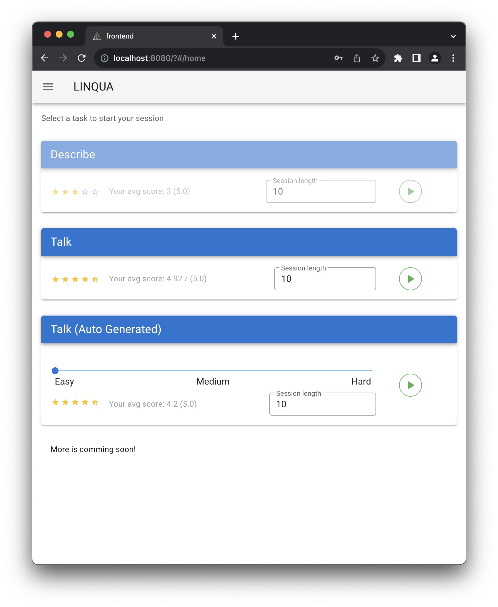

# LINQUA
## Installationsanleitung für OSX und Linux

1. Installation java runtime
2. Installation ffmpeg
```bash
$ brew install ffmpeg         //MacOS
$ sudo apt install ffmpeg     //Linux
```
3. Mit [run.sh](backend/run.sh) Skript starten um das Backend zu konfigurieren
```bash
$ bash run.sh setup
```

4. Mit [run.sh](backend/run.sh) den Server im Dev Modus starten
```bash
// Im backend Ordner
$ bash run.sh dev
```

5. Frontend Starten - Im Dev Modus

Auf Windows und OSX muss die Umgebungsvariable NODE_OPTIONS gesetzt werden

```bash
export NODE_OPTIONS=--openssl-legacy-provider
// Im frontend Ordner
$ npm install
$ npm run serve
```
6. Es kann bis zu 5 Minuten dauern, bis die Anwendung vollständig gestartet ist


## RUN.SH Hinweise
Mit dem Skript [run.sh](backend/run.sh) wird durch das Argument `setup` die Umgebung vorbereitet, mit `dev` wird der Development und `prod` der Produktionsmodus gestartet
```bash
$ bash run.sh setup
$ bash run.sh dev
$ bash run.sh prod
```

## SUBTLEX_US
Downloadlink für die SUBTLEX_US Tabelle [Download](https://osf.io/download/7wx25/)

### Warum SUBTLEX_US ?
Mit der SUBTLEX_US Tabelle haben wir eine umfrangreiche Wortdatenbank, welche nicht nur angibt wie oft ein Wort vorkommt, sondern auch schon mit einer klassifizierung der Wortart (POS-Tagging). 
Zusätzlich ist für jedes Wort, respektive dessen Wortart, eine Wahrscheinlichkeit angegeben, wie oft diese auch für das jeweilige Wort zutrifft.

## Starten der Anwendung
Die App ist nun erreichbar unter http://localhost:8080

### Loginscreen
Es gibt einen Standard Admin Account, welcher automatisch angelegt wird. Die Zugangsdaten sind **linqua-admin** und **admin123**


Nach dem Loginscreen gelangt man in das Hauptmenü.
Zuerst muss eine Wortdatenbank importiert werden und eine neue Aufgabe angelegt werden.



Dazu links oben auf das Hamburgermenü drücken und **Manage Word DB** auswählen.


An dieser Stelle muss die [SUBTLEX_US](https://osf.io/download/7wx25/) Tabelle hochgeladen werden.


Nun muss die erste Aufgabe angelegt werden. 
Dazu über das Hamburgermenü auf **Manage Tasks** klicken.


## GENERAL INFORMATION
Join Postman-Team: [Click Here](https://app.getpostman.com/join-team?invite_code=3ab5a9159a2423c81cd34ea790022164)